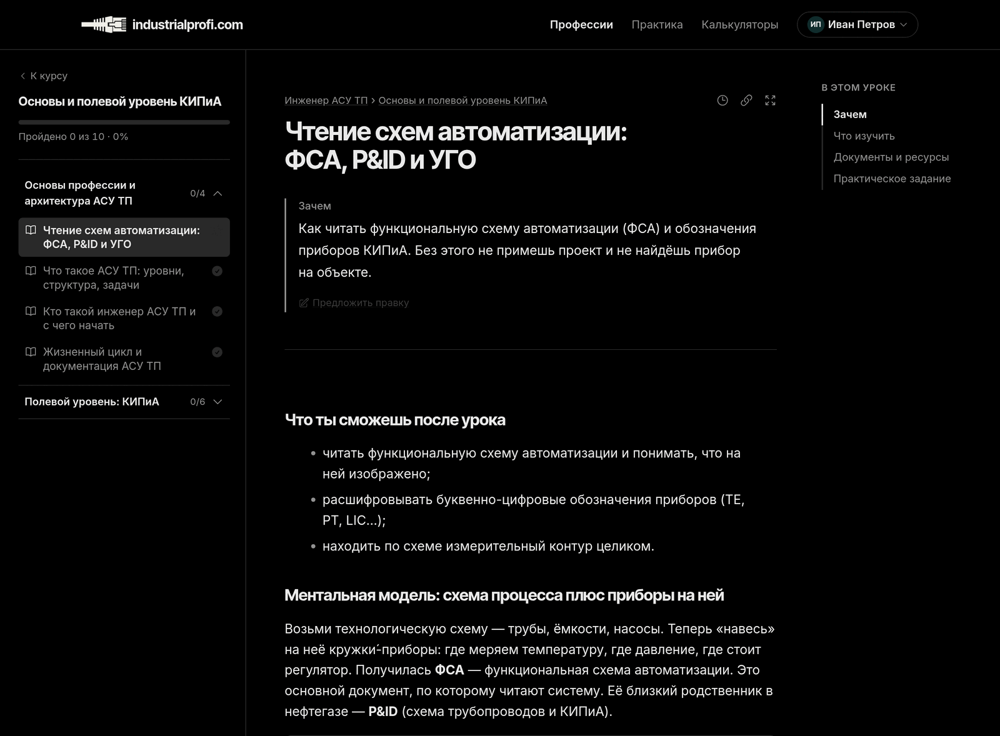
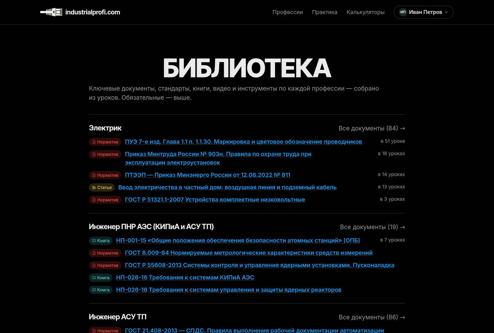
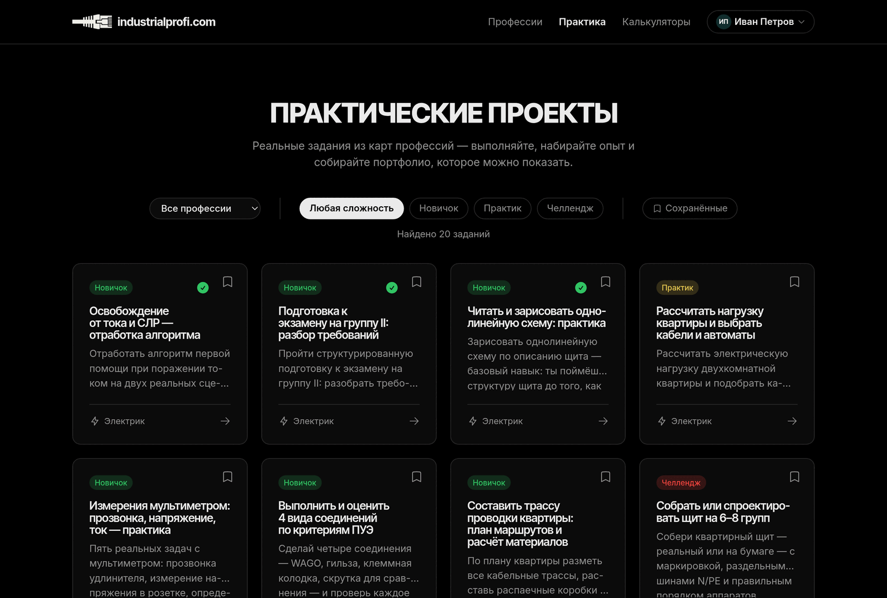
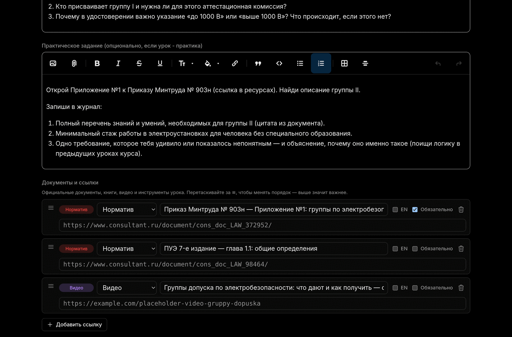
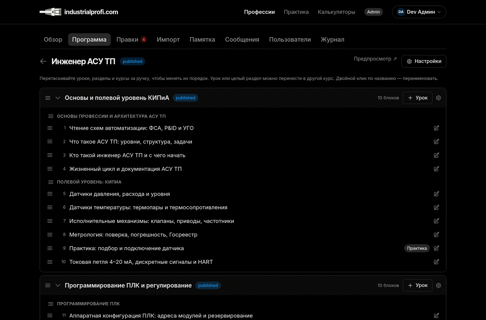
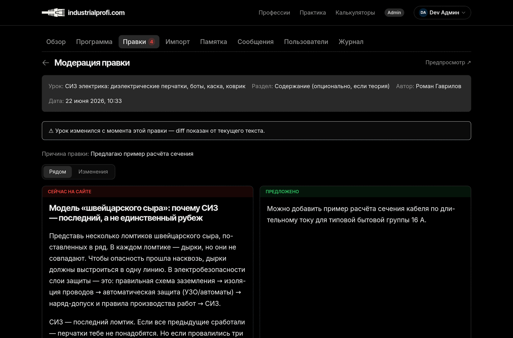

<div align="center">

# IndustrialProfi

A free, open-source learning platform that teaches industrial professions
the way real craftsmen actually learn: by reading official standards
(ГОСТ, ASME, НАКС) and doing verifiable, real-world practice.

[](https://github.com/andreiyurik/industrialprofi/actions/workflows/ci.yml)
[](LICENSE)
[](LICENSE-CONTENT)
[](.ruby-version)
[](Gemfile)

[Vision](docs/VISION.md) · [Roadmap](docs/VISION.md#roadmap--scope)

<br>



<sub>A lesson: <b>why</b> it matters → the official <b>standards</b> to read → a verifiable <b>task</b> → one binary <b>done</b>.</sub>

<br><br>

⭐ **Like the idea of a free, open encyclopedia of the trades?**
[Star the repo](https://github.com/andreiyurik/industrialprofi) — it's the cheapest way to help it find the experts who'll grow it.
· [Support development →](https://industrialprofi.com/support_us)

</div>

---

## Why this exists

Wikipedia made the world's knowledge free and open — but the deep, practical
know-how of the **trades** never really made it in. How you actually wire a
panel, weld a seam or commission a sensor still lives locked away: in scattered
standards, paywalled video courses, and the heads of a retiring generation.

**IndustrialProfi is building the open commons for that knowledge — think a
Wikipedia for the trades**, with two differences that matter: a *guided path*
(profession → course → lesson, so you always know what to learn next), and a
*friendly builder* instead of a wall of wiki-markup — so a working electrician
can improve a lesson without first becoming a wiki editor.

The raw material already exists — it lives in ГОСТ, ПУЭ, НАКС and ASME
standards — but it's scattered, intimidating, and unmapped. Welders,
electricians and instrumentation techs across the CIS have no structured, free,
standards-based path to grow. So we curate one into clear career roadmaps:

```
Profession  →  Course           →  Lesson
(Электрик)     (Охрана труда)      (ПУЭ: Правила устройства электроустановок)
```

<p align="center">
  
  <br><sub>The <b>library</b>: every official standard, book and tool — curated per profession, ranked, and linked from the lessons that use it. An open encyclopedia of the trades, in the making.</sub>
</p>

## How a lesson works

Every lesson follows the same honest, no-fluff structure — read the real source,
then prove you can use it:

1. **WHY** — one or two sentences on why this matters on the job site.
2. **OFFICIAL DOCUMENTS** — curated links to the real standards, ranked
   (★ required, ○ optional). No paraphrasing — you read the source.
3. **PRACTICAL TASK** — a concrete, verifiable assignment.
4. **✓ Mark as done** — binary progress. Done or not done, nothing in between.

Course progress is simply `completed / total`. No "in progress", no fake
gamification — just a clear map of what you know and what's next.

<p align="center">
  
  <br><sub>Theory is half of it. Every profession also has <b>real, verifiable practice</b> — paper-and-bench drills for beginners up to capstone builds — the part that actually makes a craftsman.</sub>
</p>

## How it's different

There's no shortage of ways to learn a trade online. Almost all of them are
*either* free-but-scattered *or* structured-but-paid, and almost none are built
on the official standards or open for the community to improve. The combination
is the point:

|                                              | **IndustrialProfi** | Paid video courses | Scattered standards / PDFs | YouTube tutorials |
| -------------------------------------------- | :-----------------: | :----------------: | :------------------------: | :---------------: |
| Free — forever, not a trial                  |          ✅          |         ❌          |             ✅              |         ✅         |
| Built on official standards (ГОСТ/ПУЭ/НАКС)   |          ✅          |     ⚠️ sometimes    |        ✅ (raw, unsorted)   |         ❌         |
| Structured path: profession → course → lesson |          ✅          |         ✅          |             ❌              |         ❌         |
| Hands-on, verifiable practice                |          ✅          |     ⚠️ varies       |             ❌              |     ⚠️ varies      |
| Open content, community-editable (CC BY-SA)  |          ✅          |         ❌          |             ❌              |         ❌         |
| No ads, no upsell, no account wall to read   |          ✅          |         ❌          |             ✅              |         ❌         |

We're early and don't pretend otherwise — a paid course will have more polish
today. What no one else has is *all six columns at once*: the structured depth
of a course, the authority of the source standards, and the openness of a wiki —
free for good.

## Built to grow itself

A platform this broad can't be written by one person — and it isn't meant to be.
So the editor's side of the screen got the same care as the reader's. We're
unashamed magpies: we took mechanics proven by apps we admire and adapted them
for the trades — the calm editor and UX of **Basecamp's** open-source Rails apps,
the read-the-source lesson model of **The Odin Project**, the structured roadmaps
and resource taxonomy of **roadmap.sh**, and **Wikipedia's** immutable revision
history and review pipeline. The result is a workshop that's comfortable on *both*
sides: the learner reading it, and the expert improving it.

<p align="center">
  
  <br><sub>The <b>lesson editor</b>: rich text + the official documents, each typed, ranked and drag-sorted. A friendly builder — not a wall of wiki-markup.</sub>
</p>

<table>
  <tr>
    <td width="50%" valign="top">
      
      <br><sub><b>Curriculum builder</b> — drag whole courses, sections and lessons into order. The whole profession, on one screen.</sub>
    </td>
    <td width="50%" valign="top">
      
      <br><sub><b>Suggestion review</b> — any reader can propose an edit; an expert weighs it side-by-side; the applied change becomes an immutable revision.</sub>
    </td>
  </tr>
</table>

## Tech stack

This is a deliberately boring, **build-step-free** Rails app — and that's the
point. It's a reference for how much you can ship with vanilla Rails 8 and
Hotwire, no Node.js anywhere in sight.

- **Ruby 4.0 / Rails 8.1**
- **SQLite3** + Solid Queue, Solid Cache, Solid Cable
- **Hotwire** (Turbo + Stimulus) — server-rendered HTML, no SPA
- **Pure CSS**, served as-is by **Propshaft** — no Tailwind, no PostCSS, no
  bundler, no build. The cascade is just filenames in alphabetical order.
- **Importmap** — no Node, no Webpack, no Vite
- Auth via `has_secure_password` (bcrypt) — no Devise
- **Kamal 2** + Docker + Thruster for deploys
- **Minitest** + fixtures + Capybara
- Self-hosted Inter / Inter Tight via `@font-face`, OKLCH color tokens, a
  single black-first dark theme — UI patterns mirror Basecamp's open-source
  apps (Writebook, Fizzy).

## Getting started

You need Ruby 4.0.5 and Git. No Node, no Yarn, no asset pipeline to configure.

```bash
git clone https://github.com/andreiyurik/industrialprofi.git
cd industrialprofi
bin/setup          # installs gems, prepares the database, seeds sample data
bin/dev            # starts the server at http://localhost:3000
```

Common tasks:

```bash
bin/rails test          # run the test suite
bin/rails test:system   # system tests (Capybara)
bin/rails db:migrate    # run migrations
bin/rubocop             # lint
```

## Project structure

```
app/models/                 # domain models (Path, Course, Lesson, ...)
app/controllers/            # RESTful controllers, render ERB
app/views/                  # ERB templates + Turbo Frame/Stream partials
app/javascript/controllers/ # Stimulus controllers
app/assets/stylesheets/     # all CSS — one self-contained file per component
db/migrate/                 # migrations = source of truth for schema
docs/                       # VISION.md, DEPLOY.md (English project docs)
tools/                      # reusable content-authoring tools (content tooling)
```

Content hierarchy:

```
Path (profession)  →  Course  →  Lesson  →  Resource (links to standards)
User  →  LessonCompletion  (binary: the row exists = the lesson is done)
```

## Roadmap

IndustrialProfi ships in phases — the forward roadmap lives in
[docs/VISION.md → Roadmap & scope](docs/VISION.md#roadmap--scope):

- **v0.1 — shipped:** static catalog (professions → courses → lessons, public, SEO-first)
- **v0.2 — shipped:** accounts, binary progress, dashboard, practice journal,
  activity heatmap, reader suggestions + revision history, admin panel with roles
- **v0.3 — next:** community-authored content (draft → review → published),
  search, public profiles

The user-facing roadmap lives at `/roadmap` on the site itself; the full product
thinking lives in [docs/VISION.md](docs/VISION.md).

## Contributing

Contributions are welcome — whether you write code or curate the content that
actually teaches people. Start with [CONTRIBUTING.md](CONTRIBUTING.md).

A quick heads-up on the model: the **platform is and stays open source** under
AGPL-3.0. A small set of future hosted, employer-facing features (verified
completion certificates, a candidate/employer board) may be commercial — this
is a classic **open-core** setup. Contributors sign a lightweight CLA so the
project keeps the freedom to sustain itself; details in `CONTRIBUTING.md`.

## License

IndustrialProfi is **dual-licensed**:

- **Code** — [GNU Affero General Public License v3.0](LICENSE) (AGPL-3.0).
- **Content** — the curriculum and lessons are licensed under
  [Creative Commons Attribution-ShareAlike 4.0](LICENSE-CONTENT) (CC BY-SA 4.0).

In plain terms: you're free to use, study, share and modify the **code** — and
if you run a modified version as a network service, you must make your source
available too. The **learning content** you're free to share and adapt (even
commercially), as long as you credit IndustrialProfi and keep it under the same
license. Third-party standards (ГОСТ, ASME, НАКС…) are only linked or cited and
remain their publishers' property.

## Acknowledgements

Standing on the shoulders of projects that showed the way:

- **[The Odin Project](https://www.theodinproject.com/)** — the open-curriculum
  model and the read-the-docs-then-build philosophy.
- **[roadmap.sh](https://roadmap.sh/)** — structured, visual career roadmaps.
- **[Basecamp](https://github.com/basecamp)** — the open-source Rails apps
  (Writebook, Fizzy, Once-Campfire) whose design and code conventions this
  project follows.

---

<div align="center">

### ⭐ Star · 💛 Support · ✍️ Contribute

If you believe the trades deserve an open, standards-based commons:
**[star the repo](https://github.com/andreiyurik/industrialprofi)**,
**[support development](https://industrialprofi.com/support_us)**,
or **[help build it](CONTRIBUTING.md)** — code or content, both move it forward.

<br>

Built for the people who keep the lights on, the pipes welded, and the machines running.

</div>
